## この記事は誰のために書いたのか

この記事は、**IT業界で働いていて、プログラミングは普通にできる。でもAIエージェントを使った開発の経験はほぼゼロ**、という人に向けて書いています。

最近、恐れ多くも同僚や知人にAI駆動開発についてお話しする機会が増えました。そういう人と話していると、だいたい同じところで止まっています。

> 「ネットの記事を読んでも、Skills とか Subagent とか ハーネス とか、**知らない単語が知らない単語で説明されてる**し...AIを使って実際何をすればいいのかわからないんだよね...」

これ、めちゃくちゃわかります。1年前の私も完全にそうでした。

そこで今回は、その「知らない単語の壁」を崩すことだけに絞って、この記事を作ることにしました。前編・後編の2本立てでお届けします。

- **【前編】（この記事）**：歴史をたどりながら、用語が生まれた理由を理解する
- **【後編】**：2026年現在の最前線——ハーネスとループ

### この記事のゴール（と、ゴールにしないこと）

**ゴール：AI駆動開発に出てくる用語の「概念」を正しくイメージできるようになること。それだけ。**

そのために今回は、イラストとたとえ話を多めにしています。
私自身、小難しい言葉がずらっと並んだドキュメントや記事を読んでいると、だんだん意識が遠のいていくタイプです。
そのため、細かい仕様を暗記する前に、まずは「これは何のためのものか」が頭の中に絵として浮かぶ状態を目指します。

逆に、以下は**あえてやりません**。

- ❌ 各機能の設定ファイルの書き方、オプション一覧
- ❌ 「これをコピペすれば動く」系のレシピ
- ❌ 最新機能の完全な網羅

理由は単純で、**一気に細かいところまで詰め込むとパンクするから**です。

私自身、この1年のAI界隈のスピードの速さに何度もパンクしかけました。

### 3つのお願い（先に言っておきます）

**① 詳細は必ず公式の情報を見てください**

この記事はある種の羅針盤であって、正確な辞書ではありません。実際に手を動かすフェーズになったら、必ず以下のような公式情報を確認してください。

- [Claude Code 公式ドキュメント（日本語）](https://code.claude.com/docs/ja/overview)
- [用語集（Glossary）](https://code.claude.com/docs/ja/glossary) ← **この記事を読んだ後に眺めると、驚くほど頭に入ります**
- [Anthropic 公式ブログ](https://claude.com/blog)

**② 説明はざっくりです。厳密さは犠牲にしています**

概念を掴んでもらうことを最優先にしたので、たとえ話やニュアンスの単純化を多用します。「厳密にはちょっと違うぞ」という箇所は正直あるはずです。そこはご容赦ください。**まずはざっくりと正しいイメージを獲得し、あとで公式情報で精度を上げる**——この順番が結局いちばん速いと思っています。

**③ ツールは Claude Code を例にします**

私が実際にメインで使っているのと、Claude Code がやはり一番ハーネス周り（詳細は後述します）がしっかり設計されていると思っているからです。ただし、ここで扱う概念のほとんどは Cursor でも Codex でも Copilot でも共通する、**業界の共通言語**になっています。用語さえ理解しておけば、どのツールの話にもだいたいついていけるはずです。

---

## 大前提：この1年で「AIの使い方」の何が変わったのか

用語の話に入る前に、この1年で起きた時代転換を一言でまとめます。

> **「AIに書いてもらう」から「AIに働いてもらう」へ。**

チャット欄にコードを貼って、返ってきたコードをコピペする——これは「AIに書いてもらう」です。人間が手も足も動かしています。

いま起きているのは、AIが**自分でファイルを読み、自分でコードを書き、自分でテストを回し、失敗したら自分で直す**という世界。人間は指示とゴール・制約を与えるだけ。これが「AIに働いてもらう」、つまり **AI駆動開発（Agentic Coding）** です。

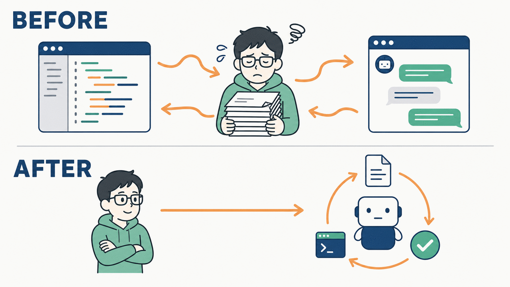

*図1｜人間がボトルネックだった時代 → 人間が方向を決める時代へ*

そしてここからが重要なのですが、

**この記事に出てくる用語のほぼ全部は、「AIに働いてもらう」を実現するために生まれた道具です。**

だから用語は、単語として覚えても頭に入りません。**「どんな困りごとがあって、それを解決するために生まれたのか」とセットで覚える**と、驚くほど定着します。この記事はその順番で進めます。

---

## この記事を貫くたとえ話：AIエージェントは「めちゃくちゃ優秀な新入社員」

先に、前編・後編を通して使うたとえ話を置いておきます。これが腹落ちすると、後の用語が全部つながります。

**AIエージェントは、こういう新入社員です。**

- 🧠 地頭は異常にいい。あらゆる言語とフレームワークの知識がある
- ⚡ 作業は爆速。人間の10倍以上のスピードで手を動かす
- 😶 でも、**あなたの会社のことは何も知らない**
- 🤯 そして、**昨日のことを覚えていない**（毎朝、記憶がリセットされる）
- 🏃 さらに、**放っておくと勝手に本番DBを触りかねない**

さて、あなたはこの新入社員のマネージャーです。どうしますか？

- オンボーディング（受け入れ）資料を渡す
- 業務手順書を整備する
- 「本番環境は勝手に触るな」というルールを作る
- 社内システムのアカウントを発行する
- 仕事が増えたら、チームを組ませる
- 成果物のレビュー体制を作る

——**これから説明する用語は、全部この「どうしますか？」への答えです。**

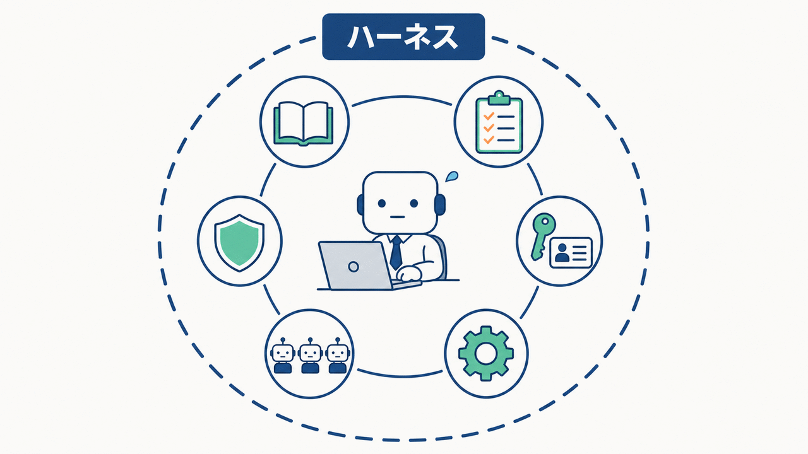

*図2｜AIエージェントを「新入社員」として捉える全体像。外側の円がハーネス*

この図の「一番外側の円」が、後編の主役です。前編ではまず、**円の中身**をひとつずつ埋めていきます。

---

## 歴史でたどる ——なぜ、その用語は生まれたのか

用語を五十音順に並べても頭に入りません。**時系列で、「困った → 解決策が生まれた」の連鎖として**見ていきます。

> ⚠️ 以下の時期は私の体感と記録ベースのざっくりした区分です。厳密なリリース日は公式のリリースノートをご確認ください。

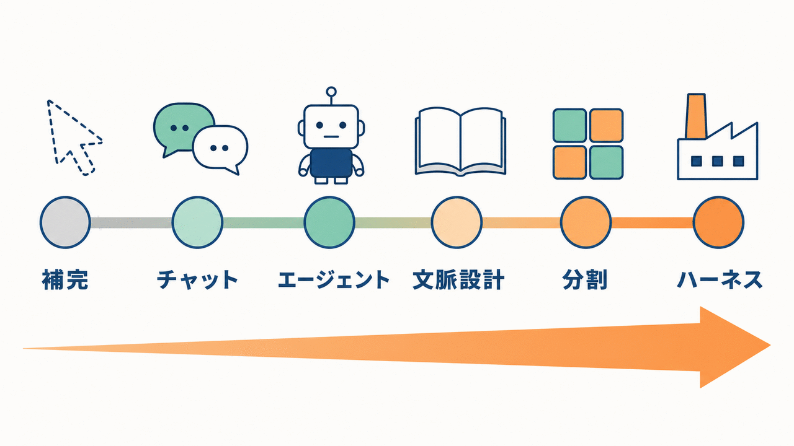

*図3｜補完からエージェント、そしてハーネスへ。AI駆動開発の進化*

### 第1世代：補完（〜2022年）「続きを書いてくれる」

GitHub Copilot に代表される、**コード補完**の時代です。

書きかけの行の続きを、うっすらグレーで提案してくれる。Tabキーで確定。あれは確かに感動的でしたが、**主導権は完全に人間**にありました。AIは「速いスニペット辞書」でした。

**この時代の限界：AIはファイル1個の中しか見ていない。設計はできない。**

### 第2世代：チャット（2022年末〜）「相談できる」

ChatGPT の登場で、AIと**対話**できるようになりました。設計を相談し、エラーメッセージを貼り付け、生成されたコードをコピペする。

このとき生まれた用語が **プロンプトエンジニアリング** です。「どう聞けば、いい答えが返ってくるか」の技術ですね。

**この時代の限界：AIは自分では何もできない。手足は人間。**

コピペの往復が地獄でした。「そのファイルの中身はこれです」「じゃあこう直して」「エラーが出ました、これです」……**人間が、AIとファイルシステムの間の通訳をやっていた**わけです。

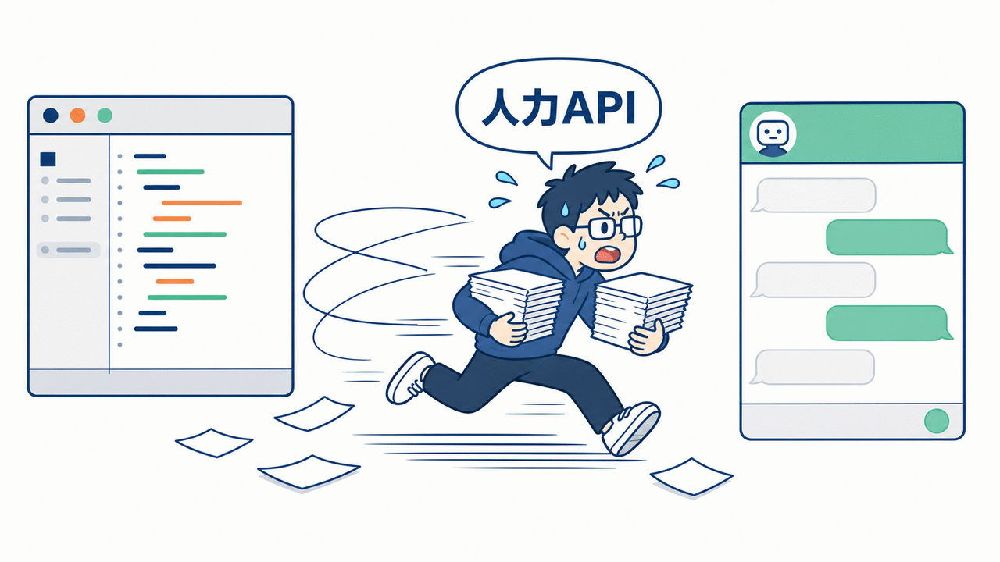

*図4｜チャットAIとファイルの間を、人間がコピペで往復していた時代*

### 第3世代：エージェント（2024〜2025年前半）「手足を持った」

ここが**最大の分岐点**です。

AIに「**ツール**」が与えられました。ファイルを読むツール、ファイルを書くツール、シェルコマンドを実行するツール。

これによってAIは「アドバイスする存在」から「**実行する存在**」になりました。この、ツールを使って自律的に動くAIを **エージェント（Agent）** と呼びます。

そしてエージェントが回している輪っかが **エージェンティックループ（Agentic Loop）** です。

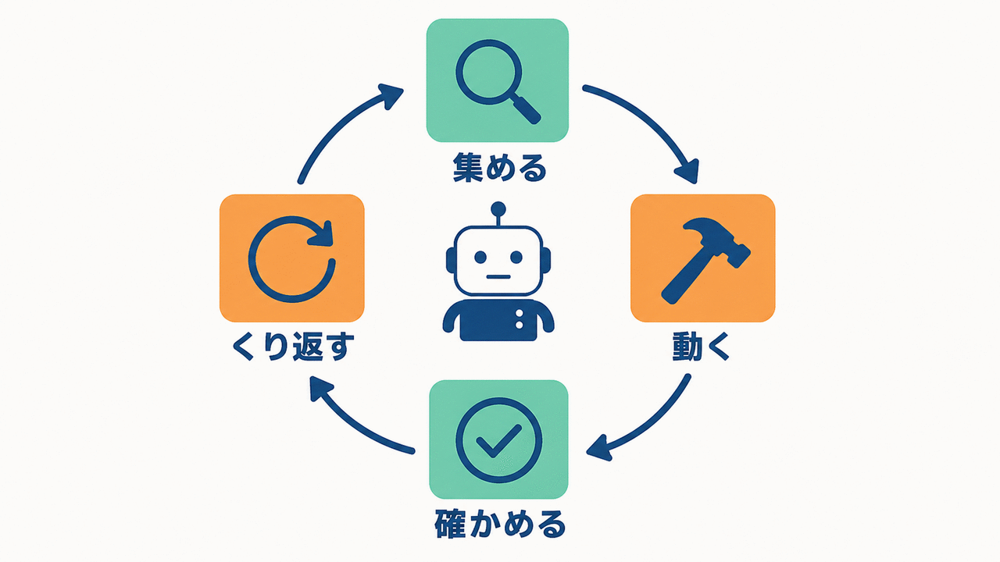

*図5｜情報を集め、実行し、検証して繰り返すエージェンティックループ*

**この図5は、前編・後編を通していちばん大事な図です。**

これから出てくる用語のほとんどは、「このループのどこに、何を差し込むか」の話だからです。困ったらこの図に戻ってきてください。

> 💡 **注：ここで言う「ループ」は、最近よく聞く「ループ」とは別物です**
>
> 最近「AIにループを回させる」「ループエンジニアリング」という言い方をよく見かけますが、あれは多くの場合、**人間が外側から仕込む長時間の自走サイクル**——タスクを与えて、完了するまで／一定間隔で何周も回し続ける運用——を指しています。
>
> 一方、図5のエージェンティックループは、**エージェントが1回の依頼をこなす中で内部的に回している基本動作**のことです。
>
> **内側で勝手に回っている歯車がエージェンティックループ、その外側に人間が被せる運用の輪がいわゆるループエンジニアリング。** 言葉は似ていますが階層が違うので、混ぜないでおくと後の話がスッキリします（この記事で単に「ループ」と言うときは、内側のほうを指します）。

### そして、バイブコーディングの時代へ

私がAI開発を始めたのは、ちょうどこの頃（2025年6月あたり）でした。

当時の私のやり方は、いま思えば完全な **バイブコーディング（Vibe Coding）** です。

> **バイブコーディング**：仕様や設計をきちんと詰めず、「なんかいい感じにして」とAIに投げ、出てきたものを雰囲気（vibe）で受け入れていく開発スタイル。

これ、**最初の1週間は最高に楽しかった**です。魔法みたいに動くものが出てくるので。

でも、すぐに壁にぶち当たります。

- 🔁 同じ指示を毎回ゼロから説明している
- 😵 「そのライブラリは使わないでって、昨日も言ったよね？」が毎日発生
- 🍝 3日後、誰にも読めないスパゲッティが完成している
- 🤷 動いてはいる。でも**なぜ動いているか誰も知らない**

**原因はシンプルで、AIが「あなたの現場のルール」を何も知らないからです。**

新入社員に、就業規則もコーディング規約も渡さずに「いい感じにやっといて」と言っているのと同じ。そりゃそうなりますよね。

### 第4世代：コンテキストエンジニアリング（2025年半ば）「記憶を持たせる」

そこで生まれた考え方が **コンテキストエンジニアリング（Context Engineering）** です。私がAI開発を始めた頃、ちょうどこの言葉が出始めていました。

> **コンテキストエンジニアリング**：AIに「何を、どの順番で、どれだけ渡すか」を設計する技術。

プロンプトエンジニアリングが「**どう聞くか**」なら、コンテキストエンジニアリングは「**何を知らせておくか**」です。後者のほうが圧倒的に効きます。

### なぜ「渡す量」が問題になるのか：コンテキストウィンドウ

ここで必須の用語が2つ。

**コンテキストウィンドウ（Context Window）**
= AIの**作業机の広さ**。会話履歴、読み込んだファイル、コマンドの出力、ルール……全部この机の上に載ります。**有限**です。

**コンパクション（Compaction）**
= 机が溢れそうになったとき、**古いものを要約して圧縮する**機能。

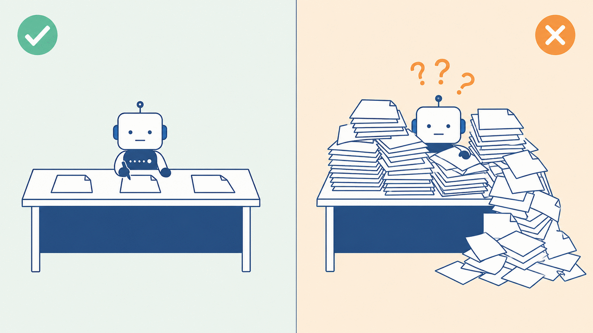

*図6｜AIの性能は、机の上に何が載っているかで決まる*

ここに、初心者がほぼ100%踏む**罠**があります。

> ❌ よくある誤解：「情報は多く渡せば渡すほど賢くなる」
> ✅ 現実：**関係ない情報を渡すほど、精度は落ちる**

会議に関係ない資料を1000ページ積まれたら、人間だって重要な1行を見落とします。AIも同じです。**コンテキストエンジニアリングは「足す技術」であると同時に「削る技術」** です。ここは本当に大事なので、太字を2回使ってでも強調しておきます。

### CLAUDE.md：AIに渡す「就業規則」

そこで登場するのが `CLAUDE.md` です。

プロジェクトのルートに置いておくと、**セッション開始時に毎回自動で読み込まれる**マークダウンファイル。ここに規約、アーキテクチャの方針、「必ずこうして」ルールを書いておきます。

新入社員に渡すオンボーディング資料そのものですね。

**そして、当時はこれしか手段がありませんでした。**

私の `CLAUDE.md` は、こんな状態になっていきました。

```markdown
# CLAUDE.md（在りし日の姿）
## コーディング規約
（50行）
## ディレクトリ構成の説明
（40行）
## デプロイ手順
（60行）
## MCPサーバーの使い方
（80行）
## テストの書き方
（50行）
## リリースフローとレビュー観点
（70行）
...
```

**全部盛り**です。デプロイ手順もテストの書き方もMCPの使い方も、全部1ファイルに詰め込んでいました。当時は他に置き場所がなかったんです。

結果どうなるか。**デプロイなんてしない日も、毎回デプロイ手順の60行が机の上に載る。** 図6の右側です。

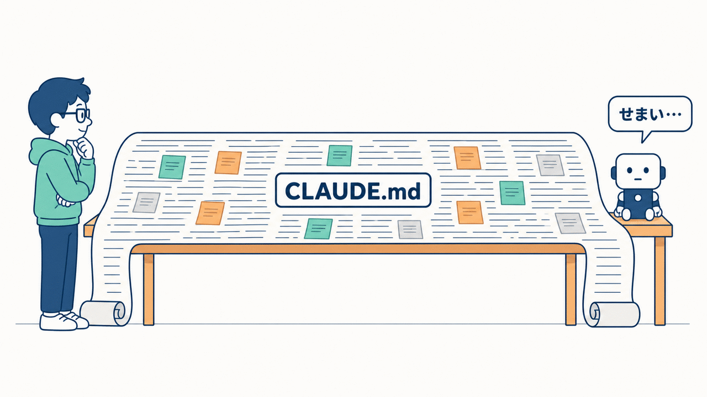

*図7｜何でもCLAUDE.mdに書くと、不要な情報まで常に読み込まれてしまう*

**「必要なときだけ、必要な知識を渡したい」——この切実な悩みが、次の世代を生みます。**

### 第5世代：モジュール化（2025年後半）「道具を分ける」

ここから怒涛の勢いで機能が出てきます。私が「AI界隈のスピード、やばくない？」と本気で思った時期です。

そして重要なのは、**この世代の用語は全部「CLAUDE.md 全部盛り問題」への回答**だということ。

### 🧩 Skills（スキル）——「業務手順書」

> **Skill**：`SKILL.md` というファイルに書かれた、手順・知識・ワークフローのまとまり。**必要になったときだけ読み込まれる。**

これが革命でした。

`CLAUDE.md` が「常に机の上にある就業規則」だとしたら、Skills は「**棚に並んでいる業務手順書**」です。デプロイするときだけ「デプロイ手順書」を棚から取ってくる。普段は棚に置いたまま。

しかも呼び出し方が2通りあります。

- **自動**：AIが「あ、これはデプロイの話だな」と判断して自分で棚から取ってくる
- **手動**：人間が `/deploy` のように名前で直接指名する

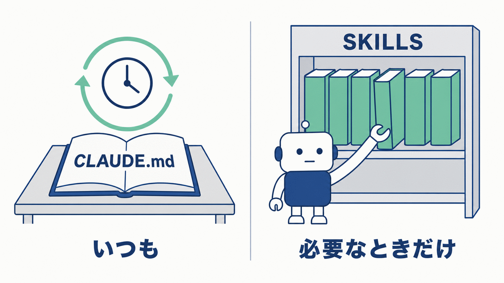

*図8｜常に必要なもの＝CLAUDE.md ／ ときどき必要なもの＝Skills*

**この使い分けが、コンテキストエンジニアリングの実践そのものです。**

なお歴史的な補足として、Skills はそれ以前の「カスタムコマンド（`.claude/commands/`）」の後継にあたります。古い記事で「スラッシュコマンドを自作する」という話を見かけたら、いまは Skills で書くのが推奨、と読み替えてください。

さらに、Skills は Anthropic 独自の機能ではなく **Agent Skills というオープン標準**になっています。「特定ツールのローカルルール」ではなく、業界の共通フォーマットになりつつある、というのは押さえておくといいポイントです。

### ⚙️ Hooks（フック）——「自動で発動する社内ルール」

> **Hook**：ライフサイクルの特定のタイミング（ツール実行前／ファイル編集後／セッション開始時など）で、**自動的に必ず実行される**ハンドラー。

ここでの最重要キーワードは **決定論的（deterministic）** です。

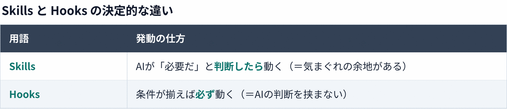

「ファイルを編集したら、必ずフォーマッタをかける」——これをお願いベースでAIに頼むと、忙しいときに忘れます。人間と同じです。Hooks にすると、**忘れようがありません**。

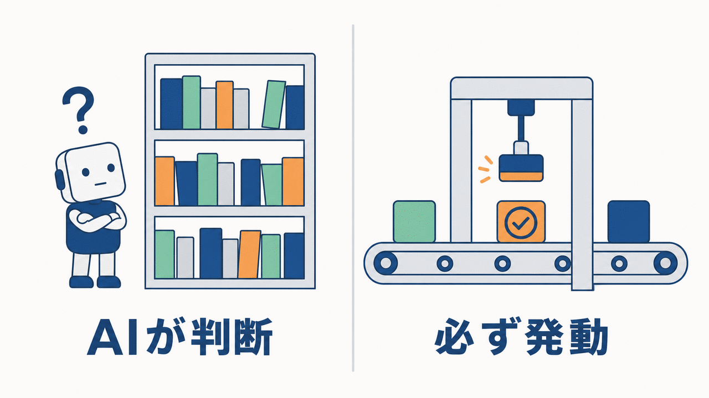

*図9｜AIの判断で使うSkills ／ 条件が揃えば必ず動くHooks*

私が Hooks を使い始めたとき、いちばん効いたのは「**AIに守らせたいルールのうち、機械的に判定できるものは全部 Hooks に移す**」という発想の転換でした。ルールをお願い（プロンプト）で守らせようとするのをやめる。これはかなり効きます。

### 🔌 MCP（Model Context Protocol）——「社外システムへのアカウント発行」

> **MCP**：AIツールを外部のデータソースやサービスに繋ぐための**オープン標準**。

AIエージェントは、デフォルトではファイルとシェルしか触れません。でも実務では Jira も Slack も Figma も DB も使いますよね。

MCP は、それらへの接続口を標準化した規格です。**新入社員に社内システムのアカウントを発行する**イメージ。MCPサーバーを繋ぐと、AIが使えるツールがその分だけ増えます。

ここでのポイントは「**オープン標準**」であること。特定ベンダー独自の仕組みではなく、対応ツールなら共通で使えます。USB-Cみたいなものだと思ってください。

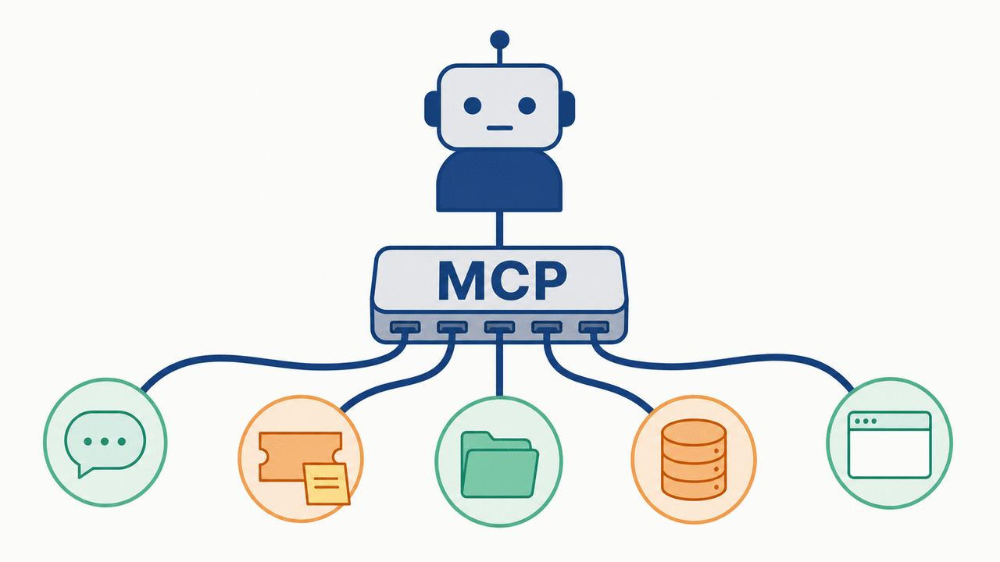

*図10｜AIとツール群をつなぐ共通規格*

> ⚠️ MCPサーバーを繋ぎまくると、**ツールの定義だけで机の上が埋まります**（上記図6の右側）。「便利そうだから全部入れる」は典型的な失敗パターン。実際、この問題への対策として、ツール定義を必要になるまで読み込まない仕組み（MCP Tool Search）も用意されているくらいです。**繋ぐものは選ぶ。** ここは最初にやらかしやすいので、先に釘を刺しておきます。

### 👥 Subagents（サブエージェント）——「部下に任せる」

> **Subagent**：**独自のコンテキストウィンドウ**を持ち、専用の役割と権限で動く、委任先のAI。作業結果の**要約だけ**を親に返す。

太字にしたところが本質です。**机が別**なんです。

たとえば「このリポジトリ全体を調べて、認証まわりの実装箇所を洗い出して」というタスク。自分でやると、大量のファイルの中身が自分の机に積み上がって、本題に入る前に机が溢れます。

サブエージェントに投げると、**調査で散らかるのは相手の机**。返ってくるのは「認証は `auth/` 配下の3ファイルです」という**きれいな要約1行**だけ。

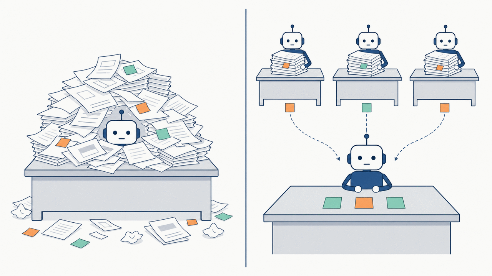

*図11｜散らかしていいのは、他人の机*

これ、**コンテキストの節約テクニックとして最強**の部類です。「AIを増やす」というより「**AIの机を増やす**」と理解するのが正確です。

さらに派生として、サブエージェントを**並列で複数走らせて**、それぞれ別の案を出させて比べる、といった使い方もできます。ここまで来ると、もはや人間のマネージャー業です。

---

## 前編のまとめ：全部、一本の線でつながっている

ここまでの流れを、もう一度「困りごと → 解決策」で並べてみます。

- コピペの往復が辛い → **エージェント**（ツールを持たせた）
- 毎回同じ説明をするのが辛い → **CLAUDE.md**（常時読まれる就業規則）
- CLAUDE.md が膨らんで机が溢れた → **Skills**（必要なときだけ開く手順書）
- お願いしても守ってくれない → **Hooks**（判断を挟まず必ず発動）
- 外部サービスを触らせたい → **MCP**（接続の共通規格）
- 調査で自分の机が溢れる → **Subagents**（机を分けて委任）

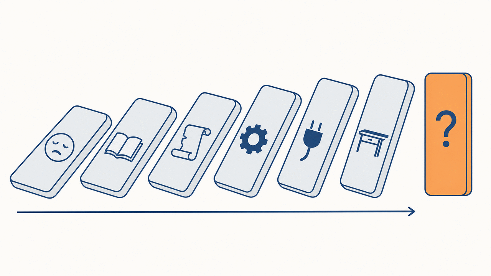

*図12｜用語は暗記するものじゃない。順番に必然として生まれてきた*

### 前編で登場した用語チートシート

あとから見返せるように、一覧にまとめておきます。ここだけスクショしておくのもアリです。

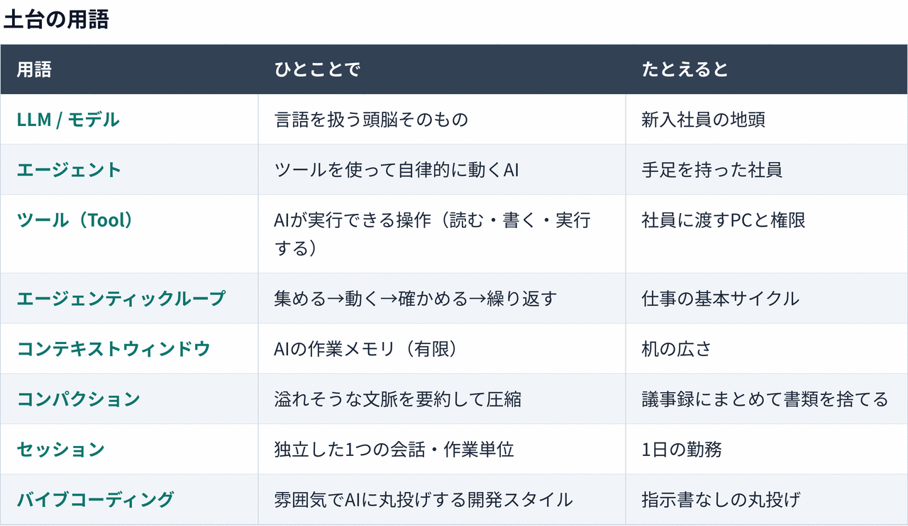

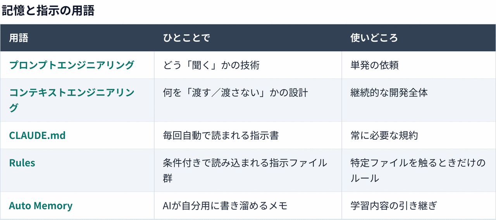

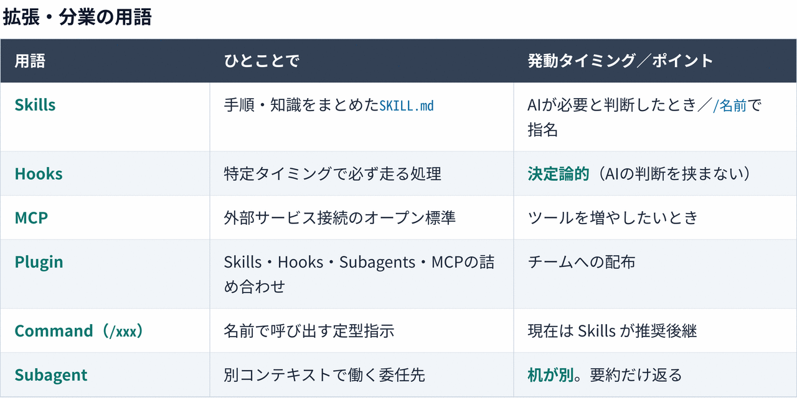

**綺麗に一本の線になっているはずです。** 丸暗記する必要はまったくありません。「なぜそれが要るのか」さえ掴めていれば、細かい仕様は公式ドキュメントを引けば済みます。

---

## 後編の予告：で、これらをどう組み合わせるの？

さて、道具は揃いました。CLAUDE.md、Skills、Hooks、MCP、Subagents。

しかし道具が増えると、当然こうなります。

> **「で、これらをどう組み合わせるのが正解なの？」**

この問いに答えるのが、2026年現在のホットトピック——**ハーネス**と**ループ**です。

図2で描いた「一番外側の円」、あれの正体です。**エンジニアが本当に設計すべきなのは、実はそこ**でした。

後編では、こんな話をします。

- 🏗 **ハーネス**とは何か（たぶん、いちばん誤解されている用語）
- 🔥 **ハーネスエンジニアリング**——エンジニアの仕事はどう変わったか
- 🔁 **検証ループ**——自動化したいなら、まずここ
- ♾ **ループエンジニアリング**——最近よく聞く「AIにループを回させる」の正体
- 🎼 **オーケストレーター**と、覚えておくべき4つの連携パターン
- 🏭 **動的ワークフロー**——ハーネスをAIが自分で組み立てる時代へ

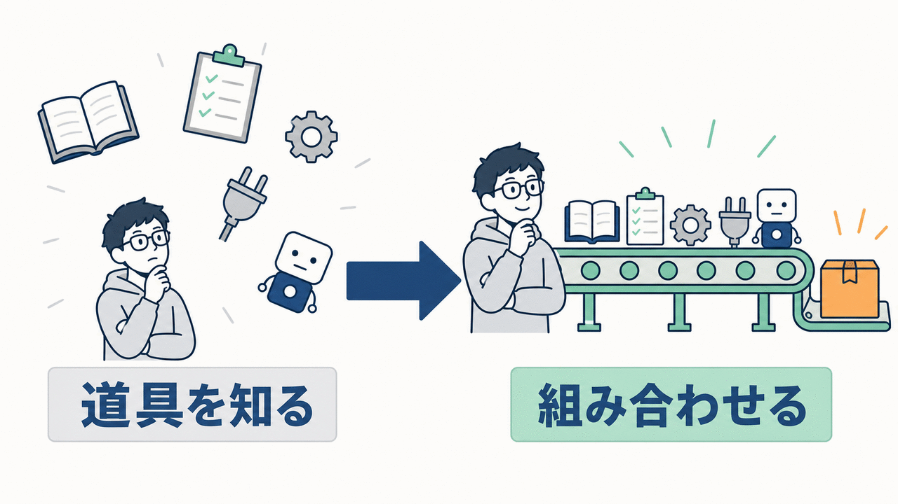

*図13｜前編の用語理解から、後編のハーネスとループへ*

**👉 後編はこちら**

https://qiita.com/shou-dev19/items/0f4ee962b89a322eefc0

---

いかがでしたでしょうか？
AI駆動開発の界隈で出てくる用語の概念を、丸っとイメージしやすくなるような解説をしてくれている記事が、意外と見つからなかったため、今回はこのような記事を作成しました。
この記事を読んでくださった方々の、"AI駆動開発用語に対する解像度"が、読む前と比べて上がっていれば幸いです。

ただ、こういう記事は読むだけだと、なかなか自分のものにならないと考えています。**毎日30分でもいいので、Claude Code や Codex などのAIエージェントを実際に動かし、何でもいいからアプリやツールを作ってみること** を強くおすすめします。

私自身も、まず手を動かして感覚をつかんでから、自分の血肉にしていくタイプです。この約1年間は、そうやってAI駆動開発の知見を少しずつ貯めてきました。この記事が、みなさんの最初の一歩を踏み出すきっかけになればうれしいです。

最後まで読んでいただきありがとうございました。

「ここの理解が違うのでは」「この用語も入れてほしい」というご意見があれば、ぜひコメントで教えてください。記事に反映させていただきます 🙏
