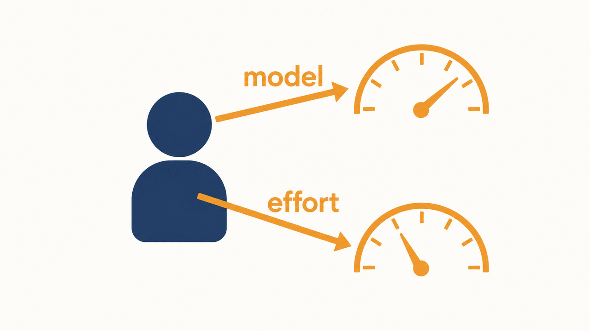
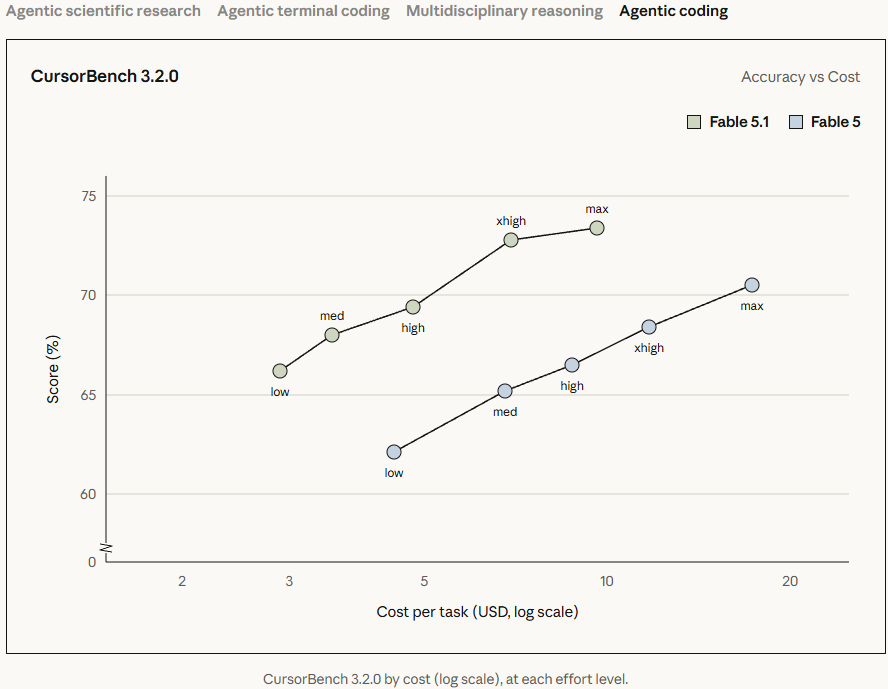
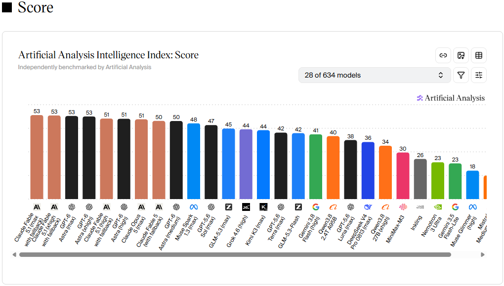
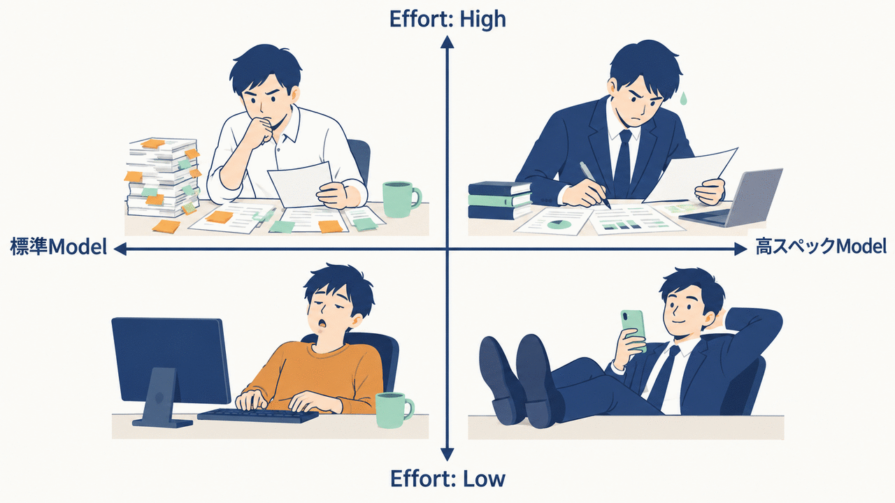
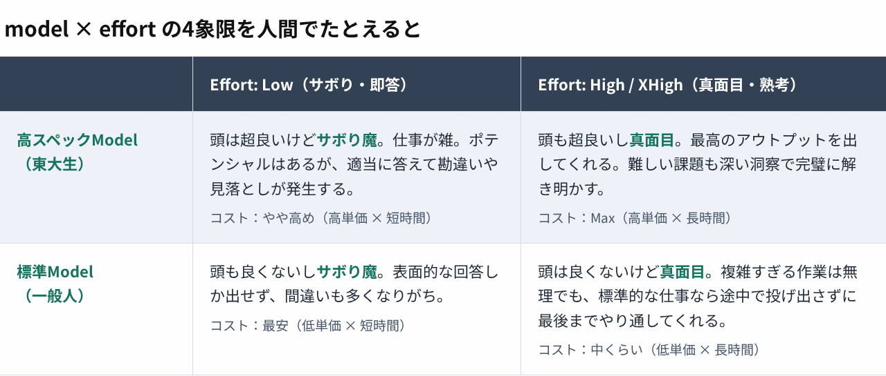
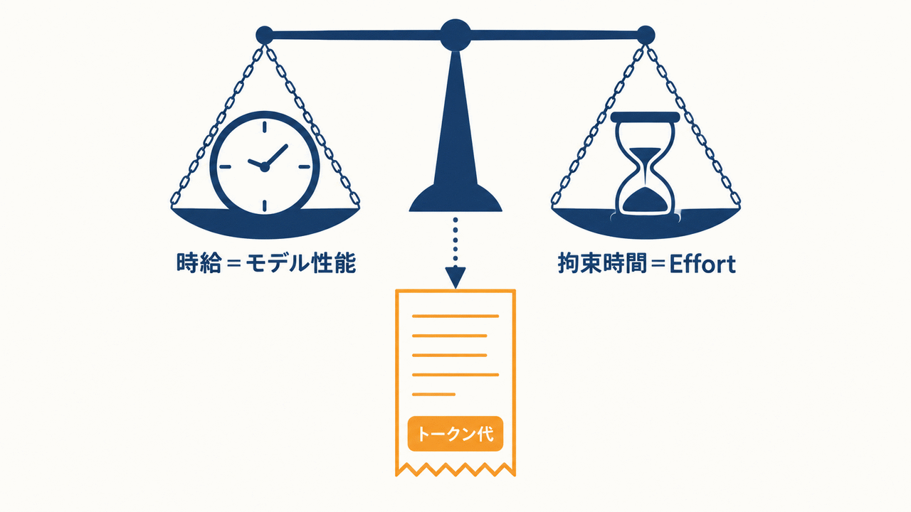
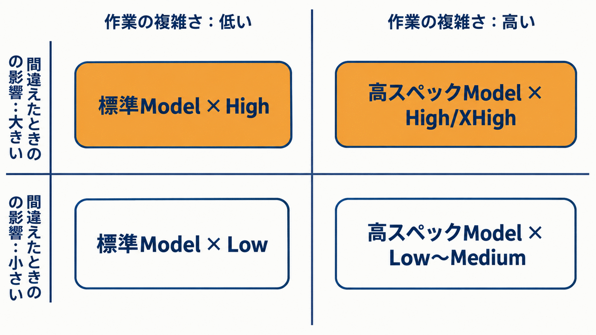
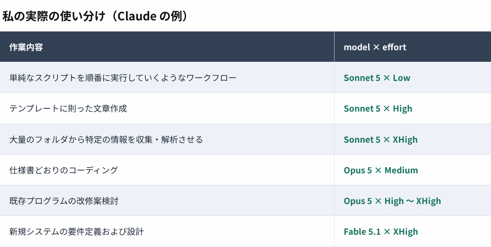

> この記事は、2026年9月16日に Qiita で公開した記事の転載です（[原文はこちら](https://qiita.com/shou-dev19/items/2d73cd63d2bf76b4dea9)）。
> note 版は、表を画像にするなど表示まわりだけ調整しています。本文の内容は同じです。

## 対象読者

この記事は、Claude Code や Codex のようなAIエージェントを使って日々仕事をしているが、タスクごとに「モデル」は選んでいても「effort」までは意識して選んでいない、という人に向けて書きました。

私自身もAIエージェントを使って開発をし始めた頃はそうでした。

> 「このタスクなら軽いモデルで十分そうだな」。モデルの使い分けはそれなりに意識していたつもりでした。でも、ふと自分の作業を振り返ってみると、effortの設定はほとんど毎回デフォルトのままだったんです。

一緒に仕事をしているメンバーの作業を見ていても、同じ傾向がある気がします。モデルの選定については語られるのに、effortの話はほとんど出てこない。これ、結構もったいないことをしているのでは、と思うようになりました。

### この記事のゴール

`effort` が何かを正しくイメージできるようになり、`model`との組み合わせを意識してタスクごとに選べるようになること。それだけです。

以前、「[AI駆動開発、用語で挫折していませんか？](https://note.com/shou_devlog/n/nc48144f38ccb)」という記事を前編・後編に分けて書きましたが、それと同じ方針で、今回も図解多め・ざっくり説明に留めます。情報量を増やしすぎると頭がパンクするからです（私自身がそうなるタイプです）。

この記事を読んで掴んでほしいのは、細かい設定値ではなく、「model」と「effort」という別々のパラメーターを両方選ぶ必要がある、という事実だけです。

### 用語の正確さについて

各用語の詳細は、必ず公式ドキュメントで確認してください。

- [Claude Code 公式ドキュメント（日本語）](https://code.claude.com/docs/ja/overview)
- [用語集（Glossary）](https://code.claude.com/docs/ja/glossary)
- [Anthropic 公式ブログ](https://claude.com/blog)

概念を掴んでもらうことを優先しているので、たとえ話や単純化を多用しています。

---

## この記事で使うたとえ話：「model」は地頭、「effort」は真面目度

先に、この記事を通して使うたとえ話を書いておきます。これが腹落ちすれば、あとの話が全部つながるはずです。

- model＝地頭の良さ（ポテンシャル）
- effort＝仕事に対する思考時間・集中力（真面目度）

頭が良くても手を抜いたら品質の低いアウトプットになるし、地頭は普通でも時間をかけて真面目に考えれば良い仕事をする。これ、人間もAIも同じなんです。

_図1 model＝地頭、effort＝真面目度｜AIの出力の質は、この2本のゲージの掛け算で決まる_

---

## `effort`とは何か

Claude Code の公式が「Model」と「Effort」について発信しています。

- https://x.com/ClaudeDevs/status/2074900291062034618
- https://platform.claude.com/docs/ja/build-with-claude/effort

もっとかみ砕くと、effortはどれだけサボらずに仕事をやりきるか、のレベル設定です。

同じモデルであっても、effortを上げると「考える時間」や「検証のステップ数」が増え、その分アウトプットの精度が上がります。逆にeffortを下げると、レスポンスは速く・安くなりますが、その代わり細部の詰めが甘くなったり、見落としが増えたりします。

「頭の良さ」と「真面目度」は別軸だ、というのがここでのポイントです。どんなに地頭が良くても、本気を出していなければ、アウトプットの質はその場しのぎのものになります。

---

## `model`と`effort`の関係

性能がものすごく高いモデルでも、effortが低いとアウトプットの品質は落ちます。ただし、アウトプットが出てくるまでの速度は速いですし、コストも安く済みます。

先日、Anthropicから Fable 5.1 モデルが発表されたときの公式ページに、わかりやすいグラフが載っていました。

- https://www.anthropic.com/claude-fable-and-mythos-5-1

このグラフはあくまでも Fable 5.1 と Fable 5 の比較ですが、基本的に他のモデル（Opus・Sonnet・Haiku など）でも同じような傾向が起きています。今まではFable 5だとeffortをmaxにしなければ出てこなかった品質が、Fable 5.1だとeffortをxhighにしても、それ以上の品質のアウトプットを出してくれるようになった、というイメージです。

model と effort のベンチマーク比較は、以下のようなサイトを見ると数字で確認できます。

- https://artificialanalysis.ai/evaluations/artificial-analysis-intelligence-index

> 💡 上記のグラフやスコアは、モデルリリースのたびに更新されていきます。この記事のスクリーンショットはあくまで**ある時点のスナップショット**なので、実際に選定するときは必ず最新のベンチマークを確認してください。

---

## `model × effort`の組み合わせを、人間でたとえる

先ほどのたとえ話を、もう少し具体的にしてみます。「高スペックModel＝東大生」「標準Model＝一般人」だとして、それぞれにeffortのLowとHighを掛け合わせると、こうなります。
※あくまでもわかりやすい例として東大生or一般人という学歴概念を扱っているだけですので、悪しからず。。。

_図2 model×effortの4象限｜地頭×真面目度で、アウトプットはこんなに変わる_

こうして並べてみると、「高スペックModel × Low」が一番もったいない組み合わせだというのがよくわかります。せっかく地頭の良いモデルを使っているのに、本気を出させていないので、宝の持ち腐れになっているわけです。
ちなみにこの後の章でも、私が実際に日々行っているタスクに対するmodelとeffortの組み合わせを紹介していますが、「高スペックModel × Low」の組み合わせは使っていないです。こんなタスクで使ってるよ。という方がいらっしゃればぜひコメントを頂きたいです🙏

> 💡 実際には、Claudeを例にすると `max` `xhigh` `high` `medium` `low` の5段階のeffortが定義されています。この記事では話をシンプルにするため、あえて `low` と `high`だけを扱っています。（私自身あまり`xhigh`以降を使わないので）実務では当然、他のレベルも選択肢に入ってきます。

---

## `model × effort`のコストイメージ

これは、人件費の計算とよく似ています。全体のコスト（トークン代）は「時給（モデル性能）× 拘束時間（Effort）」で決まります。

_図3 コスト＝時給×拘束時間｜コストは、モデルの単価とeffortの長さの掛け算_

高スペックなモデルに高いeffortをかければ、当然コストは一番高くなります。逆に、標準的なモデルに低いeffortであれば、コストは最安です。大事なのは、タスクの重要度に対してこの掛け算が見合っているかどうか、という視点です。

---

## `model × effort`の実務での使い分けイメージ

簡単な下調べやメモの要約は「標準 × Low」で最低賃金で済ませ、絶対に間違えられない企画やプログラム開発は「高スペック × High」で高級コンサルにじっくり考えてもらうイメージです。

- 目の前のボタンを順番通りに押していくだけの作業なら、頭も良くないしサボり魔だけど、低単価・短時間でコストが最安の人間に任せるのがベストです。
- 逆に、大量の書類の中から特定の情報を集めてほしい、というタスクだと、頭が良かろうが良くなかろうが、サボり魔の属性が付いている人には任せづらいので、真面目な人に頼みたくなります（頭の良し悪しはタスク内容によって調整）。

_図4 実務での使い分けフローチャート｜複雑さと、間違えたときの影響の大きさで選ぶ_

---

## 私自身の実際の使い分け（Claudeの例）

私自身はメインが Claude Code で、タスクごとに Claude から Codex を呼び出す形（マルチエージェント）で日々作業しています。ここでは Claude のモデルを例に、実際どのような作業をどのような `model × effort` で実行しているかを書いておきます。参考にしていただければと思います。

改めて見返すと、「守りの作業（決まった手順をこなす）」は低effort、「攻めの作業（考える・見落とすと痛い）」は高effortに寄っています。自分なりの傾向として、意外とはっきり出るものだなと思います。

---

## まとめ

ここまでの内容を、もう一度整理します。

- `effort`とは、どれだけサボらずに仕事をやりきるか、のレベル設定です
- `model`と`effort`は別軸で、地頭（model）と真面目度（effort）の掛け算でアウトプットの質が決まります
- 一番もったいないのは「高スペックModel × Low」。ポテンシャルがあるのに本気を出させていない状態です
- コストは「時給（model）× 拘束時間（effort）」で決まるので、タスクの重要度に見合っているかを意識します
- 選ぶ基準は「複雑さ」と「間違えたときの影響」の2軸です

`model` だけを選んで満足していたら、それはダイヤルの片方しか回していない状態です。今後、タスクごとに `model × effort` の両方を意識して選べるようになっていれば、この記事のゴールは達成です。

---

## あとがき

言われてみれば「当たり前じゃん」と思う内容だったかもしれません。ですが日々、タスクごとのeffortの設定を意識できていたでしょうか？

今回の記事を読んだ結果、「このタスクにはこの `model × effort` が適切だな」というイメージが付くようになっていれば幸いです。（眠気をこすって書いたかいがありました。

最後まで読んでいただきありがとうございました。「ここの理解が違うのでは」というご意見があれば、コメントで教えてもらえると嬉しいです🙏

---

### 関連リンク

- この記事の原文（Qiita）: https://qiita.com/shou-dev19/items/2d73cd63d2bf76b4dea9
- 技術的な指摘・議論は Qiita 版のコメント欄のほうが反応しやすいです。お気軽にどうぞ
